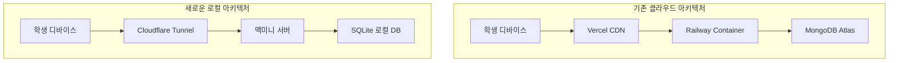

# EduTech ChatBot - 맥미니 로컬 서버 전환 가이드

<div align="center">


**AI 기반 국어 학습 플랫폼을 맥미니에서 직접 운영하기**

[](LICENSE)
[](https://nodejs.org/)
[](https://sqlite.org/)
[](https://cloudflare.com/)

</div>

## 📋 목차

- [🎯 프로젝트 개요](#-프로젝트-개요)
- [🔄 클라우드에서 로컬로 전환](#-클라우드에서-로컬로-전환)
- [🏗️ 시스템 아키텍처](#%EF%B8%8F-시스템-아키텍처)
- [🚀 빠른 시작](#-빠른-시작)
- [📖 상세 설치 가이드](#-상세-설치-가이드)
- [🔧 운영 및 관리](#-운영-및-관리)
- [🛠️ 문제 해결](#%EF%B8%8F-문제-해결)
- [📊 모니터링](#-모니터링)
- [🔒 보안 고려사항](#-보안-고려사항)

## 🎯 프로젝트 개요

EduTech ChatBot은 QR 코드로 접근하는 AI 기반 국어 학습 플랫폼입니다. 기존 클라우드 서비스(Vercel + Railway + MongoDB Atlas)에서 맥미니 로컬 환경으로 완전 이전하여 **데이터 소유권, 비용 효율성, 성능 최적화**를 달성합니다.

### 주요 특징

- 🏠 **완전한 로컬 제어**: 모든 데이터와 서비스를 맥미니에서 직접 관리
- ⚡ **고성능**: SQLite + 로컬 네트워크로 빠른 응답 속도
- 💰 **비용 효율**: 클라우드 비용 없이 전기료만으로 운영
- 🔒 **완벽한 프라이버시**: 외부 클라우드에 데이터 저장하지 않음
- 🌐 **글로벌 접근**: Cloudflare Tunnel로 전 세계 어디서나 접속 가능
- 📈 **확장성**: 언제든 클라우드로 다시 마이그레이션 가능

## 🔄 클라우드에서 로컬로 전환

### 기존 → 변경 후



### 변경사항 요약

| 구분 | 기존 (클라우드) | 변경 후 (로컬) |
|------|----------------|----------------|
| 데이터베이스 | MongoDB Atlas | SQLite (로컬) |
| 백엔드 | Railway Container | Express.js (PM2) |
| 프론트엔드 | Vercel CDN | Next.js (PM2) |
| 파일 저장 | 클라우드 스토리지 | 로컬 파일시스템 |
| 외부 접근 | 클라우드 도메인 | Cloudflare Tunnel |
| 비용 | $20-50/월 | ~$10/월 (전기료) |

## 🏗️ 시스템 아키텍처

### 전체 구조

```
Internet
    ↓
Cloudflare (SSL + CDN)
    ↓
Cloudflare Tunnel
    ↓
맥미니 (Mac Mini)
├── Nginx (리버스 프록시)
├── PM2 (프로세스 관리)
│   ├── Next.js Frontend (Port 3000)
│   ├── Express.js API (Port 3001)  
│   └── Static File Server (Port 8080)
├── SQLite Database
└── Local File Storage
```

### 기술 스택

**프론트엔드**
- Next.js 15 + React 19
- TypeScript + Tailwind CSS
- Prisma Client (SQLite)

**백엔드**
- Express.js 5 + TypeScript
- SQLite + Prisma ORM
- OpenAI API (GPT-4o-mini/GPT-4o)

**인프라**
- macOS (Mac Mini)
- PM2 (프로세스 관리)
- Nginx (리버스 프록시)
- Cloudflare Tunnel (외부 접근)

**모니터링 & 백업**
- 자동 SQLite 백업
- PM2 로그 관리
- 시스템 헬스체크

## 🚀 빠른 시작

### 전체 자동 설치 (권장)

```bash
# 1. 프로젝트 클론
git clone https://github.com/your-repo/edutech-chatbot.git
cd edutech-chatbot

# 2. 환경 변수 설정
export OPENAI_API_KEY="your-openai-api-key"
export MONGODB_URI="your-mongodb-atlas-uri"  # 마이그레이션용

# 3. 자동 배포 실행
chmod +x scripts/deploy-mac-mini.sh
./scripts/deploy-mac-mini.sh --env production --domain your-new-domain.com

# 4. Cloudflare Tunnel 설정 (선택)
./scripts/setup-cloudflare-tunnel.sh --domain your-new-domain.com

# 5. 시스템 테스트
./scripts/system-test.sh --comprehensive
```

### 수동 설치 요약

<details>
<summary>수동 설치 단계 (클릭해서 보기)</summary>

```bash
# 1. 의존성 설치
brew install node@18 sqlite nginx pm2

# 2. 프로젝트 설정
npm install
npx prisma generate
npx prisma db push

# 3. 데이터 마이그레이션
npx tsx scripts/migrate-mongo-to-sqlite.ts

# 4. 애플리케이션 빌드
npm run build

# 5. PM2로 서비스 실행
pm2 start ecosystem.config.js --env production

# 6. Nginx 설정
sudo cp infrastructure/nginx/edutech.conf /etc/nginx/sites-available/
sudo ln -s /etc/nginx/sites-available/edutech.conf /etc/nginx/sites-enabled/
sudo nginx -s reload
```

</details>

## 📖 상세 설치 가이드

### 1. 사전 요구사항

**하드웨어**
- Mac Mini (M1/M2 또는 Intel)
- 최소 8GB RAM (16GB 권장)
- 100GB+ 여유 저장공간
- 안정적인 인터넷 연결

**소프트웨어**
- macOS 12.0+
- Homebrew 패키지 매니저
- Node.js 18+
- Git

**계정**
- OpenAI API 키
- Cloudflare 계정 (도메인용)
- 기존 MongoDB Atlas 접근 (마이그레이션용)

### 2. 데이터베이스 마이그레이션

MongoDB에서 SQLite로 데이터를 안전하게 이전합니다:

```bash
# 환경 변수 설정
export MONGODB_URI="mongodb+srv://your-mongo-connection"
export DATABASE_URL="file:./data/edutech.db"

# 마이그레이션 실행
npx tsx scripts/migrate-mongo-to-sqlite.ts

# 마이그레이션 검증
sqlite3 data/edutech.db ".tables"
sqlite3 data/edutech.db "SELECT COUNT(*) FROM textbooks;"
```

마이그레이션은 다음 데이터를 변환합니다:
- **교재** (Textbooks): ObjectId → UUID
- **지문세트** (PassageSets): 관계 정보 포함
- **문제** (Questions): 선택지 배열 → JSON 문자열
- **시스템 프롬프트**: 버전 히스토리 포함

### 3. 서비스 구성

PM2를 사용한 프로세스 관리:

```bash
# 프로덕션 환경 실행
pm2 start ecosystem.config.js --env production

# 서비스 상태 확인
pm2 status
pm2 logs

# 자동 시작 설정
pm2 startup
pm2 save
```

각 서비스별 포트:
- **Frontend**: http://localhost:3000
- **Backend API**: http://localhost:3001
- **Static Files**: http://localhost:8080

### 4. Nginx 리버스 프록시

```bash
# Nginx 설정 복사
sudo cp infrastructure/nginx/edutech.conf /etc/nginx/sites-available/edutech-chatbot

# 도메인 수정
sudo sed -i.bak "s/your-new-domain.com/actual-domain.com/g" /etc/nginx/sites-available/edutech-chatbot

# 사이트 활성화
sudo ln -s /etc/nginx/sites-available/edutech-chatbot /etc/nginx/sites-enabled/

# 설정 테스트 및 재시작
sudo nginx -t
sudo nginx -s reload
```

### 5. Cloudflare Tunnel 설정

외부 접근을 위한 보안 터널 구성:

```bash
# 터널 설정
./scripts/setup-cloudflare-tunnel.sh \
  --domain your-domain.com \
  --email your@email.com

# 터널 상태 확인
cloudflared tunnel info edutech-chatbot
```

설정 완료 후 접근 가능한 URL:
- **메인 사이트**: https://your-domain.com
- **API**: https://api.your-domain.com
- **정적 파일**: https://cdn.your-domain.com

## 🔧 운영 및 관리

### 일상적인 관리 작업

```bash
# 서비스 상태 확인
pm2 status
nginx -t

# 로그 확인
pm2 logs
tail -f /var/log/nginx/edutech_error.log

# 서비스 재시작
pm2 restart all
sudo nginx -s reload

# 데이터베이스 백업
./scripts/backup-restore.sh backup --full --cloud

# 시스템 상태 점검
./scripts/system-test.sh
```

### 데이터베이스 관리

```bash
# 백업 생성
./scripts/backup-restore.sh backup --full

# 백업 목록 확인
./scripts/backup-restore.sh list

# 특정 백업으로 복원
./scripts/backup-restore.sh restore backup_20241201_143022

# 자동 백업 스케줄 설정
./scripts/backup-restore.sh schedule --enable
```

### 모니터링

**PM2 모니터링**
```bash
pm2 monit              # 실시간 모니터링
pm2 info edutech-api   # 특정 프로세스 정보
pm2 logs --lines 100   # 최근 로그 확인
```

**시스템 리소스**
```bash
# CPU/메모리 사용률
htop

# 디스크 사용량
df -h
du -sh /var/www/edutech-chatbot

# 네트워크 상태
netstat -an | grep :300[01]
```

**데이터베이스 상태**
```bash
# 데이터베이스 크기
ls -lh data/edutech.db

# 무결성 검사
sqlite3 data/edutech.db "PRAGMA integrity_check;"

# 통계 정보
sqlite3 data/edutech.db "ANALYZE; SELECT * FROM sqlite_stat1;"
```

## 🛠️ 문제 해결

### 일반적인 문제들

**1. 서비스가 시작되지 않음**
```bash
# PM2 프로세스 확인
pm2 kill
pm2 start ecosystem.config.js --env production

# 포트 충돌 확인
lsof -i :3000
lsof -i :3001

# 권한 문제 확인
ls -la data/
chmod 644 data/edutech.db
```

**2. 데이터베이스 연결 오류**
```bash
# SQLite 파일 확인
file data/edutech.db
sqlite3 data/edutech.db ".schema"

# Prisma 재생성
npx prisma generate
npx prisma db push
```

**3. Nginx 설정 오류**
```bash
# 설정 문법 확인
sudo nginx -t

# 로그 확인
tail -f /var/log/nginx/error.log

# 설정 다시 로드
sudo nginx -s reload
```

**4. Cloudflare Tunnel 문제**
```bash
# 터널 상태 확인
cloudflared tunnel info edutech-chatbot

# 터널 재시작
sudo launchctl unload /Library/LaunchDaemons/com.cloudflare.cloudflared.plist
sudo launchctl load /Library/LaunchDaemons/com.cloudflare.cloudflared.plist

# DNS 전파 확인
dig your-domain.com
```

### 시스템 복구

**전체 시스템 재시작**
```bash
# 1. 모든 서비스 중지
pm2 stop all
sudo nginx -s stop

# 2. 데이터베이스 백업
./scripts/backup-restore.sh backup --db-only

# 3. 서비스 재시작
pm2 start ecosystem.config.js --env production
sudo nginx

# 4. 상태 확인
./scripts/system-test.sh
```

**데이터 손상 시 복구**
```bash
# 최신 백업으로 복원
./scripts/backup-restore.sh restore latest

# 또는 특정 백업으로 복원
./scripts/backup-restore.sh list
./scripts/backup-restore.sh restore backup_20241201_143022

# 서비스 재시작
pm2 restart all
```

## 📊 모니터링

### 자동 모니터링 설정

```bash
# 시스템 상태 확인 cron job 추가
(crontab -l; echo "*/15 * * * * /var/www/edutech-chatbot/scripts/system-test.sh > /tmp/edutech-health.log 2>&1") | crontab -

# 백업 스케줄 설정
./scripts/backup-restore.sh schedule --enable
```

### 주요 메트릭

**성능 지표**
- API 응답 시간: < 2초
- 프론트엔드 로딩: < 5초
- 데이터베이스 쿼리: < 100ms
- 메모리 사용량: < 4GB

**가용성**
- 서비스 가동률: 99.9%
- 평균 다운타임: < 1분/월
- 복구 시간: < 5분

## 🔒 보안 고려사항

### 네트워크 보안

```bash
# macOS 방화벽 활성화
sudo /usr/libexec/ApplicationFirewall/socketfilterfw --setglobalstate on

# 필요한 포트만 개방 (Cloudflare Tunnel 사용시 불필요)
# sudo pfctl -f /etc/pf.conf
```

### 데이터베이스 보안

```bash
# 데이터베이스 파일 권한 설정
chmod 600 data/edutech.db
chown $(whoami):staff data/edutech.db

# 백업 암호화 (선택사항)
gpg --symmetric data/backup.db
```

### Cloudflare 보안 설정

1. **SSL/TLS 모드**: Full (Strict) 권장
2. **WAF 규칙**: Bot 보호, Rate Limiting
3. **Access 규칙**: 관리자 페이지 IP 제한
4. **DDoS 보호**: 자동 활성화

## 📝 추가 정보

### 프로젝트 구조

```
edutech-chatbot/
├── apps/
│   ├── web/                 # Next.js Frontend
│   └── api/                 # Express.js Backend
├── packages/
│   ├── database/           # DB 추상화 레이어
│   ├── config/             # 환경 설정
│   └── shared/             # 공통 유틸리티
├── data/
│   ├── edutech.db          # SQLite 데이터베이스
│   ├── files/              # 정적 파일 (QR 코드 등)
│   └── backups/            # 자동 백업
├── infrastructure/
│   ├── nginx/              # Nginx 설정
│   └── cloudflare/         # Cloudflare 설정
├── scripts/
│   ├── deploy-mac-mini.sh  # 자동 배포
│   ├── migrate-mongo-to-sqlite.ts
│   ├── backup-restore.sh   # 백업/복구
│   ├── setup-cloudflare-tunnel.sh
│   └── system-test.sh      # 시스템 테스트
├── prisma/
│   └── schema.prisma       # 데이터베이스 스키마
├── ecosystem.config.js     # PM2 설정
└── README.md              # 이 문서
```

### 환경별 설정

**로컬 개발 환경**
```bash
npm run dev                 # 개발 서버 실행
npm run dev:api            # API만 실행
npm run dev:web            # 웹만 실행
```

**프로덕션 환경**
```bash
npm run build              # 프로덕션 빌드
pm2 start ecosystem.config.js --env production
```

### 클라우드 재이전 준비

언제든 다시 클라우드로 이전할 수 있도록 설계:

```bash
# PostgreSQL로 마이그레이션
scripts/migrate-sqlite-to-postgres.sh --target aws

# Docker 컨테이너화
docker build -t edutech-chatbot .
docker run -p 3000:3000 edutech-chatbot

# Kubernetes 배포
kubectl apply -f k8s/
```

## 🤝 기여하기

1. Fork the repository
2. Create your feature branch (`git checkout -b feature/AmazingFeature`)
3. Commit your changes (`git commit -m 'Add some AmazingFeature'`)
4. Push to the branch (`git push origin feature/AmazingFeature`)
5. Open a Pull Request

## 📄 라이선스

이 프로젝트는 MIT 라이선스 하에 배포됩니다. 자세한 내용은 [LICENSE](LICENSE) 파일을 참조하세요.

## 🆘 지원

문제가 발생하거나 질문이 있으시면:

1. **이슈 등록**: [GitHub Issues](https://github.com/your-repo/edutech-chatbot/issues)
2. **시스템 진단**: `./scripts/system-test.sh --comprehensive`
3. **로그 확인**: `pm2 logs` 및 `/var/log/nginx/`

---

<div align="center">

**EduTech ChatBot** - AI 기반 국어 학습의 새로운 경험

[🏠 홈페이지](https://your-domain.com) • [📖 문서](https://your-domain.com/docs) • [💬 지원](https://your-domain.com/support)

</div>